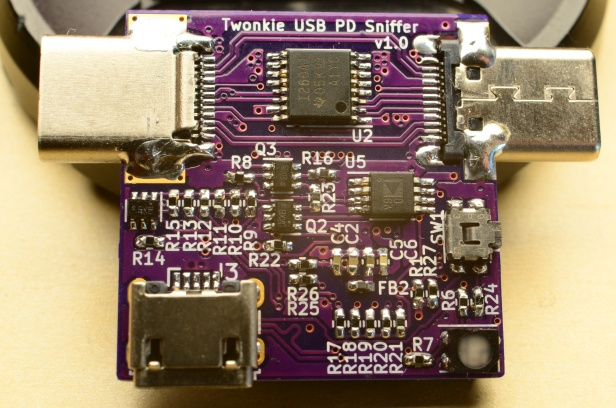
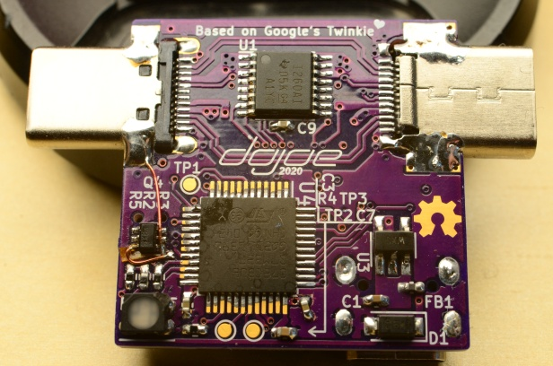

# Twonkie - a USB-PD sniffer based on Google's [Twinkie](https://www.chromium.org/chromium-os/twinkie)

Twonkie is a USB-PD sniffer/injector/sink based on a Google project called Twinkie, re-engineered to be made in one-off quantities by mere mortals.

Twinkie is a great and pretty low-cost solution, and it's open-source so anyone could make their own, but unfortunately the Twinkie design uses a six-layer PCB and all BGA/wafer-scale parts - both of which are usually unavailable to the humble hobbyist.

So I designed the Twonkie, a slightly wonky sibling of Twinkie. It uses a four-layer PCB that can be manufactured cheaply by lots of services like OSHPark, and it makes a point to use only leaded parts for easier soldering (though the main microcontroller can optionally be QFN too via a dual footprint). The most difficult parts are likely the passives which are all 0402, and the USB-C connectors which are used in an unconventional way by misusing 90° upright connectors as 1.6mm straddle mounts (living up to its name).

## What does it look like?

Lookie here!

The PCB is exactly 1 inch squared, so $10 will get you three at OSHPark. In fact, let me take care of that for you:

<a href="https://oshpark.com/shared_projects/VxczZuoj"></img></a>

_(Disclaimer: I am not affiliated with OSHPark, I just love their service to bits and they've been super helpful chaps time and time again.)_

The v1.0 Gerbers in this repo no longer need the botch wires around Q4 either, I'll update the photo as soon as I get the next board revision back.

## What's changed compared to the original Twinkie?

 * A bootloader button in addition to the USB_ID pin based bootloader selection.
 * Uses the INA260 part which has an internal sense resistor, which saves space and routing pains.
 * The microcontroller pins are rearranged for easier routing, so you'll need a different firmware. Binaries are provided and firmware sources that don't need a full ChromeOS build system will follow soon.
 * The USB-C connectors are attached in a hair-raising straddle mount configuration. The way they're soldered to the PCB makes them rock solid though, maybe even more solid than the original Twinkie, and they transfer TB3 20Gbit/s lanes just fine.

# TODOs

 * [ ] Easy-to-build firmware sources
 * [ ] Assembly instructions
 * [ ] Get Twinkie support upstreamed in sigrok/PulseView
 * [ ] Nicer v1.0 photos

# Similar projects

 * As luck would have it, [Greg Davill](https://github.com/gregdavill) started a project with the exact same goal at a very similar time, so there's now two of us :) https://github.com/gregdavill/PD-sniffer

# Licenses

## Hardware (as found in the `hw` subdirectory)

The hardware design of <a property="dct:title" rel="cc:attributionURL" href="https://github.com/dop3j0e/Twonkie">Twonkie</a> by <a rel="cc:attributionURL dct:creator" property="cc:attributionName" href="https://github.com/dop3j0e">Joachim "dojoe" Fenkes</a> is licensed under <a href="http://creativecommons.org/licenses/by/4.0/" target="_blank" rel="license noopener noreferrer" style="display:inline-block;">CC BY 4.0</a>

## Firmware (as found in the `fw` subdirectory)

TODO: Mirror Google's license here
